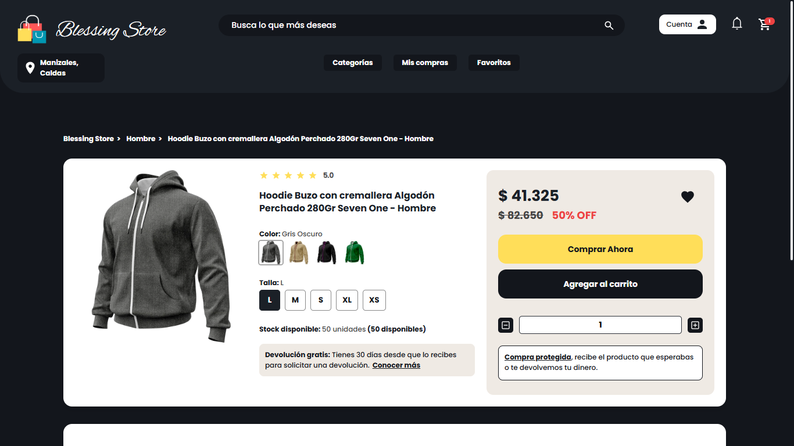

# BLESSING STORE BETA

 
 
 
 
 
 
 
 
 
 
 
 
 
 
 
 
 

 
---

## Descripción del proyecto

**Blessing Store** es una aplicación web de comercio electrónico (**e-commerce**) que permite a los usuarios explorar productos, agregarlos al carrito, marcar como favoritos y gestionar su perfil personal.  
La plataforma está construida con un enfoque **full stack** en el ecosistema JavaScript (Node.js + React).




---

## ✨ Características

- **SPA** (Single Page Application) con **React 18**  
- **API RESTful** construida con **Express** + **Node.js**  
- Comunicación entre frontend y backend con **Axios**  
- Autenticación segura con **JWT** + middlewares de protección  
- Sistema de **Registro** e **Inicio de sesión**  
- **Favoritos** y **carrito de compras** persistente por usuario  
- **Rutas protegidas** para usuarios autenticados  
- Backend estructurado bajo el patrón **MVC** (Model - View - Controller)  
- Variables de entorno fácilmente configurables **(.env)**  

---

## 🛠️ Tecnologías utilizadas

### Backend

- **Node.js** + **Express.js**
- **MySQL** (conector mysql2)
- **JWT** para autenticación
- **bcryptjs** para encriptación de contraseñas
- **dotenv** para configuración
- **joi** para validación
- **cookie-parser** y **cors**

### Frontend

- **React 18**
- **React Router DOM**
- **Axios** para consumo de API
- **React Toastify** para notificaciones
- **Vite** como herramienta de desarrollo
- **ESLint** como herramienta de linting

---

## 🏗️ Arquitectura del proyecto

El proyecto está estructurado en dos capas principales:

- **Backend (API RESTful)**: Sigue el patrón MVC.  
  Se compone de controladores, modelos, rutas y middlewares, permitiendo una gestión clara de la lógica de negocio.

- **Frontend (SPA)**: Basada en React + Vite.  
  Organizada en componentes reutilizables, páginas y contextos globales (Auth, Cart, Favorites).

---

## 📂 Estructura del proyecto

| Carpeta / Archivo  | Descripción                                       |
|--------------------|---------------------------------------------------|
| `/backend`         | API RESTful con Express, lógica de negocio (MVC)   |
| `/frontend`        | Aplicación React SPA (Single Page Application)    |
| `mydb.sql`         | Script de creación de la base de datos MySQL       |
| `README.md`        | Documentación del proyecto                         |

### **Backend:**  
Estructura modular siguiendo el patrón MVC:  
- Rutas  
- Controladores  
- Middlewares  
- Modelos

### **Frontend:**  
Estructura basada en:  
- Componentes reutilizables  
- Páginas dinámicas  
- Contextos globales (Context API)  
- Utilidades

---

##  ⚙️ Instalación y configuración

### Requisitos

- Contar con los recursos, tecnologias y herramientas mencionadas previamente.

### Instalación del Backend

```bash
cd backend
npm install
npm start
```

## Instalación Frontend

```bash
cd frontend
npm install
npm run dev
```
---

## 💾 Base de Datos

Importa el archivo `mydb.sql` en tu servidor MySQL.

Configura las credenciales en el archivo `.env` del backend.

---

## 💻 Uso del sistema

- Registro y autenticación de usuarios  
- Consulta de productos por categorías  
- Gestión de favoritos y carrito  
- Administración de perfil y pedidos  
- Navegación en páginas informativas

---

## ⚠️ Consideraciones

### Estado actual: Beta

- Aún sin panel de administración  

### Recomendaciones para producción: 

- Implementar HTTPS  
- Aplicar CORS más restrictivo  
- Almacenamiento de imágenes en la nube
---

##  📫 Contacto y créditos

Desarrollado por **Jhon Yara**  
Email: jhoncodecreator@gmail.com
